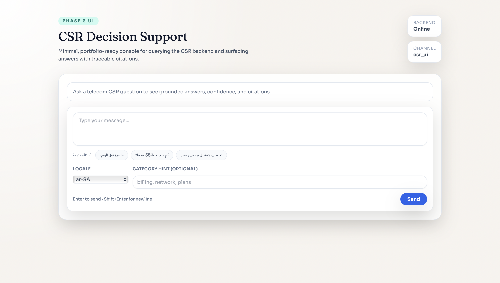
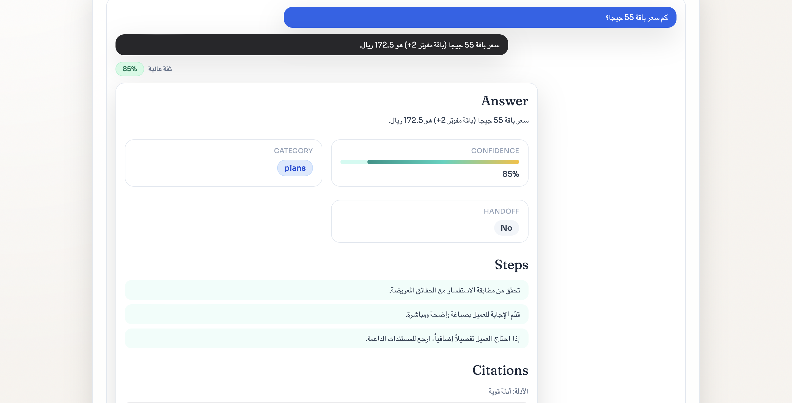

# CSR Decision Support Agent

A portfolio-ready decision-support system built for telecom CSR workflows,
combining grounded answers, confidence scoring, handoff logic, and traceable citations.

**Live demo:** https://etisalat-agent.vercel.app  
**API:** https://etisalat-agent-backend.onrender.com

## What This Project Does

- Exposes a FastAPI backend with `GET /health`, `POST /query`, and `GET /metrics`.
- Provides a React + Vite CSR console that submits telecom support queries and renders:
  - Grounded answers
  - Confidence scores
  - Handoff status
  - Action steps
  - Supporting citations

## UI Overview

  
**Empty state:** A clean CSR console with example prompts for grounded telecom queries.

  
**Grounded response:** Answer, confidence, handoff status, steps, and traceable citations in one view.

## Example

A real telecom CSR query processed through the system:

**Question**
```text
ما مدة نقل الرقم؟
```

**Response**
```json
{
  "answer": "المدة القانونية القصوى لنقل رقم الهاتف المتنقل لا تتجاوز 3 ساعات عمل.",
  "citations": [
    {
      "source": "raw/data/compass_artifact_...markdown.md",
      "chunk_id": "fact",
      "score": 1.0,
      "snippet": "المدة القانونية القصوى لنقل رقم الهاتف المتنقل لا تتجاوز 3 ساعات عمل."
    }
  ],
  "confidence": 0.85,
  "category": "porting",
  "handoff": false
}
```

This demonstrates: retrieval-grounded answers, explicit confidence scoring,
and traceable citations surfaced directly in the CSR UI.

## Design Decision

The core challenge was calibrating confidence in a way that stays useful for CSR decision support without sounding falsely certain. I chose a retrieval-first calibrated threshold approach because this system is meant to be grounded and auditable. High confidence is reserved for answers backed by direct evidence and citations; unsupported or ambiguous answers fall back to lower confidence or handoff. This keeps the system safer and more honest for telecom support workflows.

## Evaluation

Initial evaluation results on a 20-question telecom CSR test set are available in [`backend/eval/results.md`](./backend/eval/results.md).

## Quickstart

Run the full stack with one command:
```bash
make dev
```

<details>
<summary>Manual setup</summary>

**Backend**
```bash
cd backend
python -m venv .venv
source .venv/bin/activate
pip install -e .
uvicorn app.main:app --reload --host 0.0.0.0 --port 8000
```

**Frontend**
```bash
cd frontend
npm install
npm run dev
```

</details>

## Tests
```bash
make test        # backend + smoke
npm run test:e2e # Playwright E2E
```

## Stack

| Layer    | Tech                    |
|----------|-------------------------|
| Backend  | FastAPI, Python         |
| Frontend | React, Vite, TypeScript |
| Testing  | Pytest, Playwright      |
| CI       | GitHub Actions          |